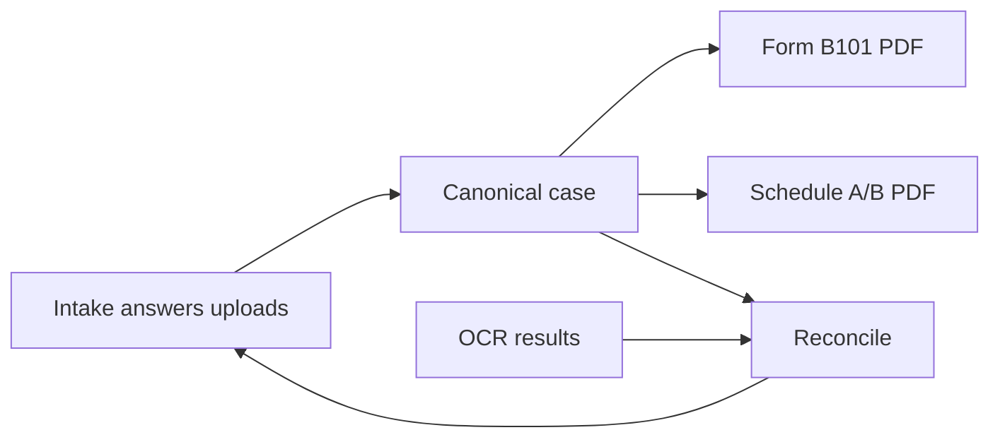

# Architecture overview

## Data flow

- **Intake** (answers, uploads, flags) is held in React state and persisted to localStorage via `state/IntakeProvider.tsx` and `state/autosave.ts`.
- **Canonical model:** Intake is converted into a canonical case representation by `engine/transform.ts` (`intakeToCanonical`). This canonical schema is the single source of truth for court forms.
- **Form generation:** Form B101 (Voluntary Petition) is filled from canonical data via `engine/export/b101.ts` (`generateB101`). Schedule A/B can be generated from the legacy intake path (`export/generateScheduleAB.ts`) or from the engine (`engine/export/scheduleAB.ts`).
- **OCR:** Uploaded documents can be sent to an optional backend OCR service. Extracted data is reconciled against the canonical case in `ocr/reconcile.ts` (`reconcileOcrResultAgainstCanonical`). The UI lets the attorney accept OCR values or keep intake values.

## Frontend

- **Stack:** React 18, TypeScript, Vite. UI: MUI Joy.
- **State:** `IntakeProvider` (answers, uploads, flags, current step, view mode). Attorney overlays (financials, creditor matrix) in localStorage under `gbi:*` keys.
- **Structure:** Client flow uses `form/steps`, `ui/Layout`, `ui/StepShell`, `ui/FieldRenderer`, `ui/Review`. Attorney experience is in `ui/AttorneyDashboard` and `ui/workspace/` (tabs, filing drawer, documents, OCR review).

## Backend

- **Default:** No server. The app is a static frontend; all data is in memory and localStorage.
- **Optional:** Python OCR service in `backend/ocr-service` (FastAPI + PaddleOCR). Used for document extraction (paystubs, bank statements, tax returns). If the service is unavailable, OCR features degrade gracefully; the rest of the app works unchanged.
